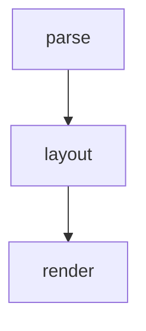
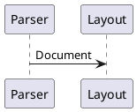

Setext heading, level one
=========================

Every block kind below appears in no other corpus file. This file exists so the
layout goldens carry one readable instance of every `mt_doc::Block` variant, and
so the four kinds that share the code-block box are exercised by an artifact
rather than only by a unit test.

Setext heading, level two
-------------------------

## Raw HTML

<div class="callout">
  <strong>Raw HTML</strong> lays out as its own source in the code-block style,
  because there is no HTML engine here and the honest presentation of a
  permanent failure state is the source with its language named.
</div>

A paragraph after the block, so the golden shows the HTML in flow rather than in
isolation.

## Diagrams

All five of the diagram kinds, so that both diagram languages occur: `vega-lite`
carries JSON and the other four carry YAML.





```vega-lite
{"mark": "bar", "data": {"values": [{"a": 1}, {"a": 3}, {"a": 2}]}}
```

```flowchart
st=>start: Open file
e=>end: Draw
st->e
```

```sequence
Alice->Bob: a display list
Bob-->Alice: pixels
```

## Footnotes

Footnotes are off in muya's own default options[^why], so this is the only
corpus file the layout goldens parse with the extension on, and the golden's
`parse` header line says which options produced it.

[^why]: `Options::MUYA_DEFAULT` sets `footnote: false`, matching muya's config.

## HTML entities

A named reference is the visible-text map's one substituting kind, and this is
the only place in the corpus one occurs: &amp; is five block bytes and one
visible byte, and &lt; and &gt; are four and one. All three decode to a
character this directory already contains, which is deliberate, because the
coverage gate unions the codepoints of the input and a substitution is how a
new one would reach the shaper without being checked.

A numeric reference is not a token at all. The rule is an alternation over the
269 named entries of the reference's escapeCharacter table, so &#60; stays
literal source and lays out as five copied columns beside the one column its
named twin becomes.
